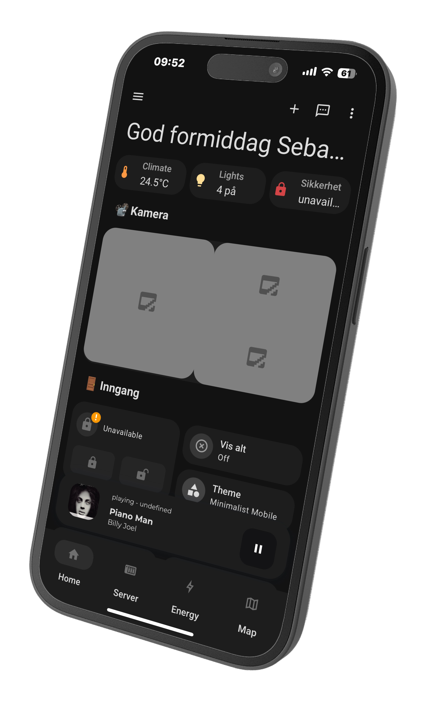

Written Instructions:

1. Place the two themes from the themes folder in this repository into the themes folder of your HomeAssistant instance.
2. Create a new dashboard in HomeAssistant and paste the code from the raw view file into the Raw Configuration Editor.
   
What is HaHome?
HaHome is a dashboard design for HomeAssistant, inspired by HomeKit and Google Home. It was created by Sebastian.

